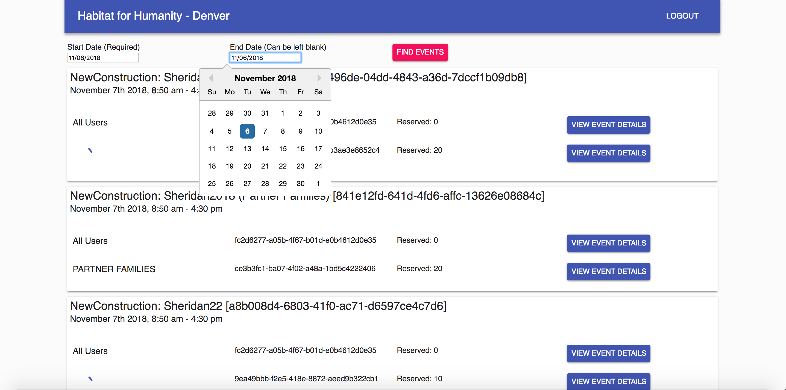

## habitat-group-contacts

MERN stack

# Creating a local Eclipse project from git repository

In Eclipse menu, select File / Import... / Projects from Git.

After files are copied, execute the following command in both root directory and client directory using the command:

`npm install`

# Running the local dev server

Once the local setup is complete for both the root and client directories. You can run the dev server while in the root directory using the command:

`npm run dev`

# Setting Up a Local Dev Server

To setup a local dev server, keys for 3rd party API's need to be added in order to provide database management and authentication.

## Setup config/dev.js file

The first step is to setup the dev.js file and confirm that it is included in the .gitignore file.

There is an example file called **ex_dev.js.** Remove the **ex\_** so the file says only **dev.js.** If you are using VS Code or Atom the file should turn grey indicating that it will not be commited.
**DO NOT COMMIT YOUR DEV KEYS TO GITHUB**

## Google OAuth Setup

1.  Navigate to https://console.developers.google.com/apis
2.  On the top bar to the right of the **GoogleAPIs** logo is your project list. Click project list button and make a new project.
3.  Name the project your_project_name-dev (You can use a different name if you want, just make sure you remember which project it is for)
4.  Wait for ~30 seconds for the project to be generated and then navigate to the project.
5.  Click "Enable APIs and SERVICES at the top of the dashboard.
6.  Search for "Google+ API," click "ENABLE" and wait for it to load.
7.  On the Left Navbar click on Credentials link.
8.  Click on "OAuth consent screen" and enter a product name such as "your_project_name-dev." For the dev server the remaining fields can be left blank. Select Save.
9.  Click on Credentials again and now click the "Create Credentials" and then select "OAuth Client ID."
10. Select the "Web Application" radio button. The Name can be left the same but the Restrictions need to be setup as follows:

For **localhost** using the following urls:
- Authorized JavaScript origins: http://localhost:5000
- Authorized redirect URIs: http://localhost:5000/api/auth/google/callback and http://localhost:3000/api/auth/google/callback
- Select Create.

For **PRODUCTION** replace the localhost and port (http://localhost:5000) with the actual site url
 - Authorized JavaScript origins: https://yoursiteurl.com
 - Authorized redirect URIs: https://yoursiteurl.com/api/auth/google/callback

11. Now the OAuth client ID and secret key should be provided. Add these as a string to their respective fields in the **dev.js** file.

- googleClientID: 'Google Client ID'
- googleClientSecret: 'Google Client Secret',

## Mongo DB Setup

1.  Any monogDB instance can be used for this portion. If you are unfamiliar with setting up a mongoDB you can use https://mlab.com to setup an easy development database.
2.  After making an account you should be on the home page which has two "+ Create New" buttons. Click the top botton which is associated to the "MongoDB Deployments"
3.  Click any of the three cloud providers (I am using Google Cloud Platform) and then select the "SANDBOX" plan type.
4.  Select your region and then name your database "your_database_name-dev" and finish submitting the server.
5.  Once you are back on the home page select the "your_database_name-dev" server you just made and click on the "USERS" tab.

> :warning: **Important Note: These are database administrator accounts and not user accounts made through OAuth**

6.  Click on "Add database user" and make a user account.
7.  Copy the mongodb:// url under the "To connect using a driver via the standard MongoDB URI (what's this?):" and add it to the following key in the **dev.js** file.

- mongoURI: 'Place mongoDB URL + login Here'
- Replace the dbuser and dbpassword fields with your login information. Do not include the "<" and ">."

## Passport Cookie Setup

1.  For a local dev you can enter any random string similar to a password. For production you can use a more secure random number/password generator.

- cookieKey: 'Place cookieKey Here'
